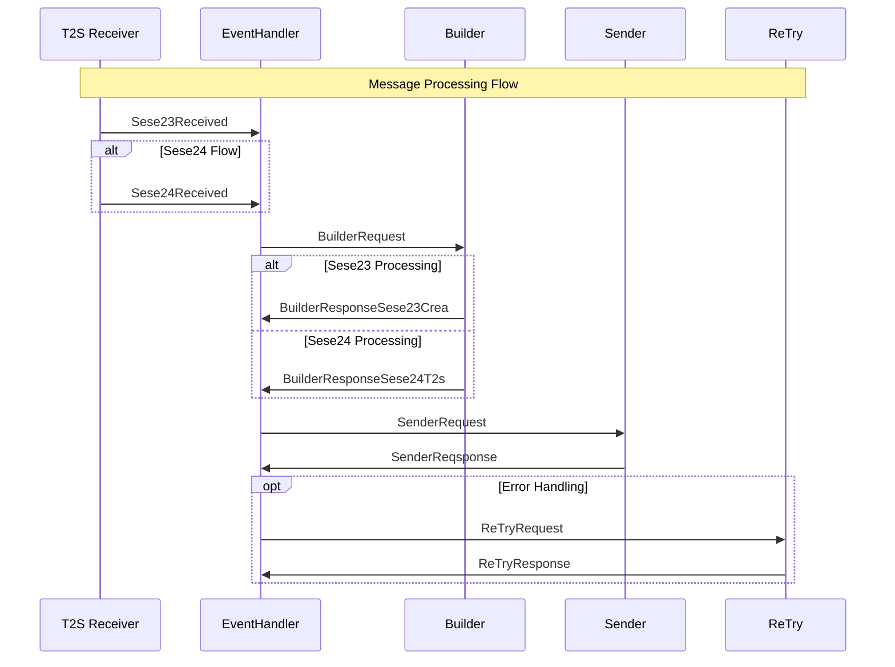

# Sequence Diagrams for Business Processes

Document complete flows:

```mermaid
sequenceDiagram
    participant T2S as T2S Receiver
    participant EH as EventHandler
    participant B as Builder
    participant S as Sender
    participant RT as ReTry

    Note over T2S,RT: Message Processing Flow
    
    %% T2S message receipt
    T2S->>EH: Sese23Received
    alt Sese24 Flow
        T2S->>EH: Sese24Received
    end
    
    %% Builder interaction
    EH->>B: BuilderRequest
    alt Sese23 Processing
        B->>EH: BuilderResponseSese23Crea
    else Sese24 Processing
        B->>EH: BuilderResponseSese24T2s
    end
    
    %% Sender interaction
    EH->>S: SenderRequest
    S->>EH: SenderReqsponse
    
    %% Retry handling if needed
    opt Error Handling
        EH->>RT: ReTryRequest
        RT->>EH: ReTryResponse
    end
```