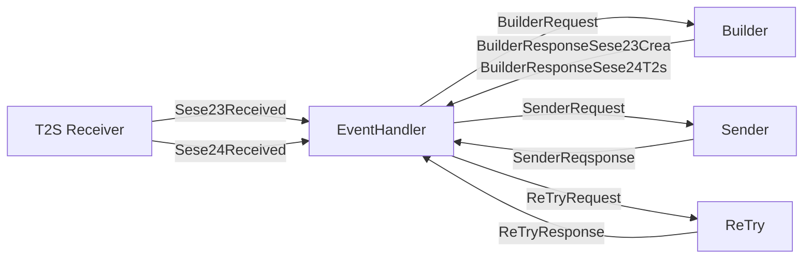

# Service Interaction Diagrams

```mermaid
flowchart LR
    T2S["T2S Receiver"]
    EH["EventHandler"]
    B["Builder"]
    S["Sender"]
    RT["ReTry"]
    
    T2S -->|Sese23Received| EH
    T2S -->|Sese24Received| EH
    
    EH -->|BuilderRequest| B
    B -->|BuilderResponseSese23Crea\nBuilderResponseSese24T2s| EH
    
    EH -->|SenderRequest| S
    S -->|SenderReqsponse| EH
    
    EH -->|ReTryRequest| RT
    RT -->|ReTryResponse| EH
```